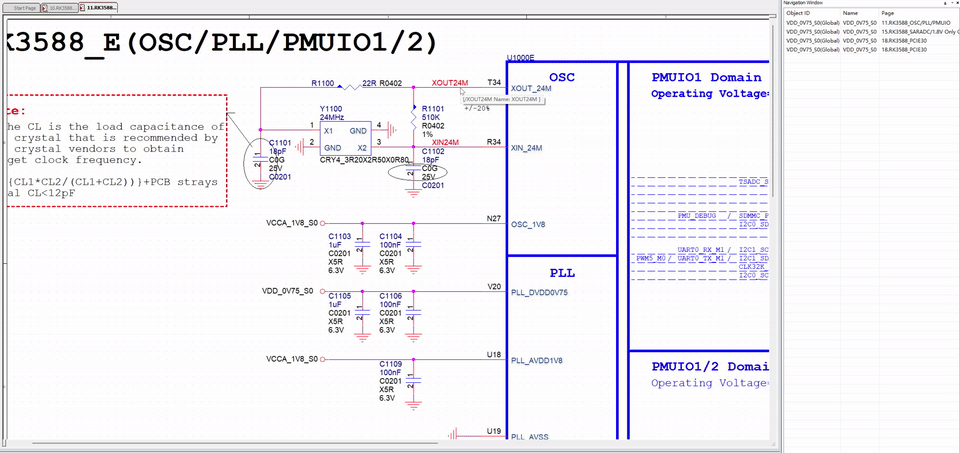
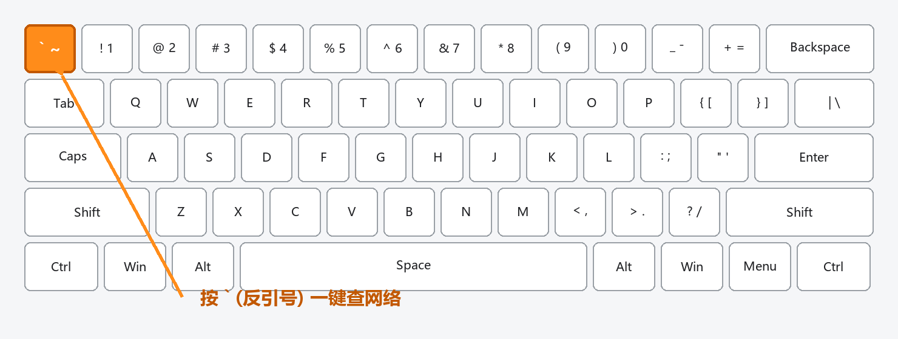

# OrCAD Signals 快捷键工具（` 一键查网络）

在 OrCAD Capture 中查看某个网络（Net）的跨页分布，默认操作是：选中线 → 右键 → 点 Signals，步骤繁琐且没有快捷键。本工具用 AutoHotkey 把这一系列操作压缩成一个快捷键：**鼠标悬停在导线上按 `` ` ``（反引号键），直接弹出 Signals 面板**，全程约 0.3 秒。

## 效果演示

鼠标悬停在导线上，按一下 `` ` ``，右侧立即弹出该网络的跨页分布：

热键位置（Tab 上方、数字 1 左边的反引号键）：

按下 `` ` `` 后自动完成：

1. 左键选中鼠标下的导线（出现高亮）；
2. 右键建立对象上下文（Signals 命令正确定位目标网络的关键，菜单会闪一下）；
3. 直接向 Capture 主窗口投递 Signals 内部命令；
4. `Esc` 关闭右键菜单。

随后右侧弹出 Signals 导航面板，显示该网络在所有原理图页的分布，双击即可跳转。

## 适用版本

- ✅ 已实测：**OrCAD Capture 17.2**（17.4 同源，理论上通用）
- ⚠️ 16.6 及更早版本：本身带 Macro 菜单，可优先考虑宏方案；本脚本的命令 ID 也可能不同，需按下文"版本适配"修改
- ⚠️ OrCAD X（23.x+）：原生支持自定义快捷键（Edit → Preferences → Shortcuts），建议优先用原生功能

## 安装使用（2 分钟）

### 1. 安装 AutoHotkey v1.1

到官网下载并安装 **AutoHotkey 1.1**（注意是 1.1 版，不是 v2）：

https://www.autohotkey.com/download/1.1/

### 2. 下载脚本

下载本仓库的 `OrCADSignals.ahk`，放到任意固定目录（例如 `C:\Tools\`）。

### 3. 运行

双击 `OrCADSignals.ahk`，系统托盘出现绿色 **H** 图标即生效。

### 4.（可选）开机自启动

1. 按 `Win + R`，输入 `shell:startup` 回车，打开启动文件夹；
2. 把 `OrCADSignals.ahk` 的快捷方式复制进去。

## 使用方法

1. 在 OrCAD Capture 原理图页面中，把**鼠标悬停在任意导线上**（无需先点选）；
2. 按 **`` ` ``（反引号键，Tab 上方、数字 1 左边）**；
3. 右侧弹出 Signals 面板，显示该网络在每页的分布，双击条目跳转并高亮。

连续查不同网络：直接把鼠标移到另一根线上再按 `` ` `` 即可。

> 热键选择反引号的原因：它是原理图输入文字时几乎用不到的键，不会和属性编辑、网络标号输入冲突，且中文输入法下不受影响。

## 自定义

用记事本打开 `OrCADSignals.ahk` 即可修改，改完后右键托盘 H 图标 → **Reload Script** 生效。

| 想改什么 | 改哪里 |
|---|---|
| 换快捷键 | 把 `SC029::` 改成其他按键：`s::` = 单键 S，`!s::` = Alt+S（`!` = Alt，`^` = Ctrl，`+` = Shift） |
| 调速 | 三处 `Sleep` 分别为左键后 / 右键后 / 发命令后的等待毫秒数，默认各 100ms（总约 300ms）。⚠️ 这是实测稳定值，**不建议再调低**，否则会出现查到上一个网络的问题 |

## 版本适配（命令 ID 不同怎么办）

脚本里的 `14844` 是 Signals 命令在 17.2/17.4 中的内部 ID。如果按热键后右键菜单闪了但 Signals 面板没弹出，在你的版本上这样查 ID：

1. 打开文件：`<Cadence安装目录>\share\orResources\OrCAD_Capture\XML\ENU\OrCAD_Capture.xml`
2. 搜索 `ID_FOLLOW_SIGNAL`，找到它下方的 `<id>数字</id>`
3. 用该数字替换脚本中 `PostMessage, 0x111, 14844, ...` 里的 `14844`

## 原理说明

本工具不是简单模拟"右键 → 点 Signals 菜单项"（17.2/17.4 的右键菜单项没有键盘加速键，模拟点击菜单不稳定），而是：

- **左键 + 右键组合**：实测发现 Capture 的 Signals 命令只认"右键建立的对象上下文"——如果只发命令，它会沿用上一次右键过的网络；如果只有左键选中，命令同样查不到新网络。因此脚本先左键选中（给出高亮反馈），再右键建立上下文；
- **绕过菜单**：右键菜单弹出后不做任何菜单点击，直接向 Capture 主窗口投递 `WM_COMMAND` 消息（命令 ID 14844，即菜单定义中的 `ID_FOLLOW_SIGNAL`），等效于点击 Signals 菜单项但更可靠，最后用 `Esc` 关闭菜单；
- **命令 ID 来自菜单定义文件**：`OrCAD_Capture.xml` 中 `ID_FOLLOW_SIGNAL` 的 `<id>` 值，不随工程或会话变化。

## 常见问题

- **按了没反应**：确认 Capture 是当前活动窗口（脚本只在 Capture 窗口生效），且托盘有绿色 H 图标。
- **查到的是上一个网络**：延时被改小了，恢复默认 100/100/100。
- **菜单闪了但面板没出**：你的版本命令 ID 可能不同，按"版本适配"一节修改。

## 卸载

1. 右键托盘绿色 H 图标 → **Exit**；
2. 删除 `OrCADSignals.ahk` 及启动文件夹里的快捷方式（如有）；
3. 卸载 AutoHotkey（可选）。

## License

MIT
